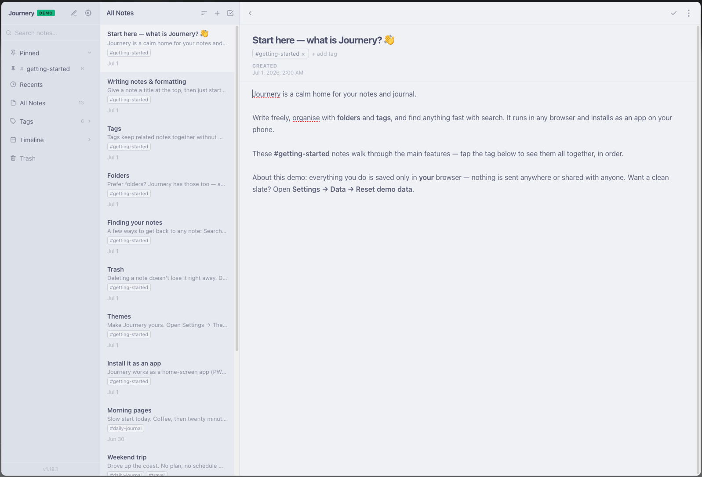
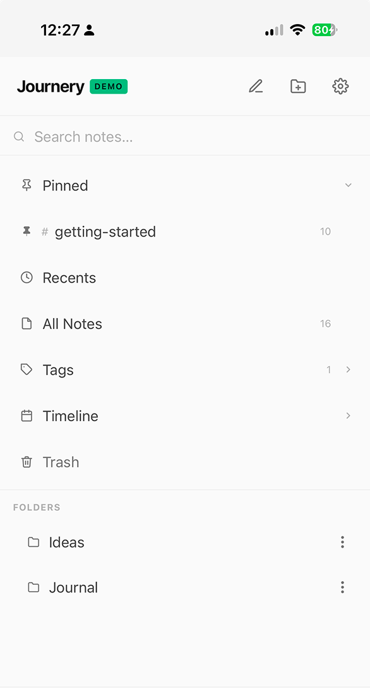
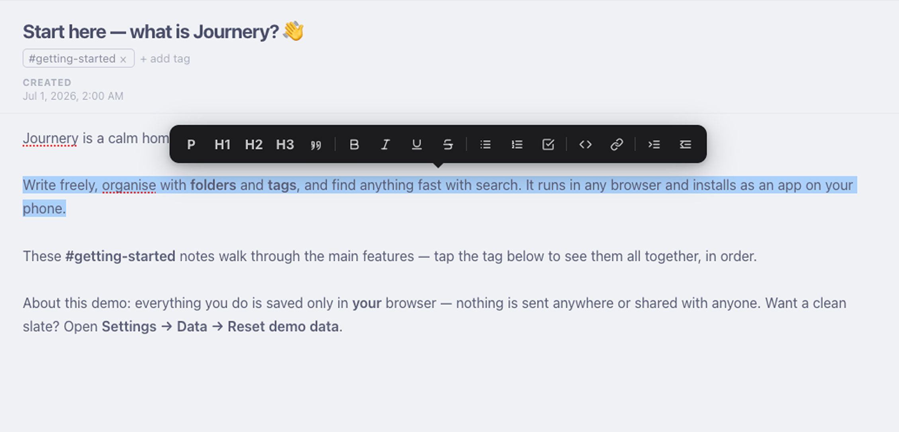
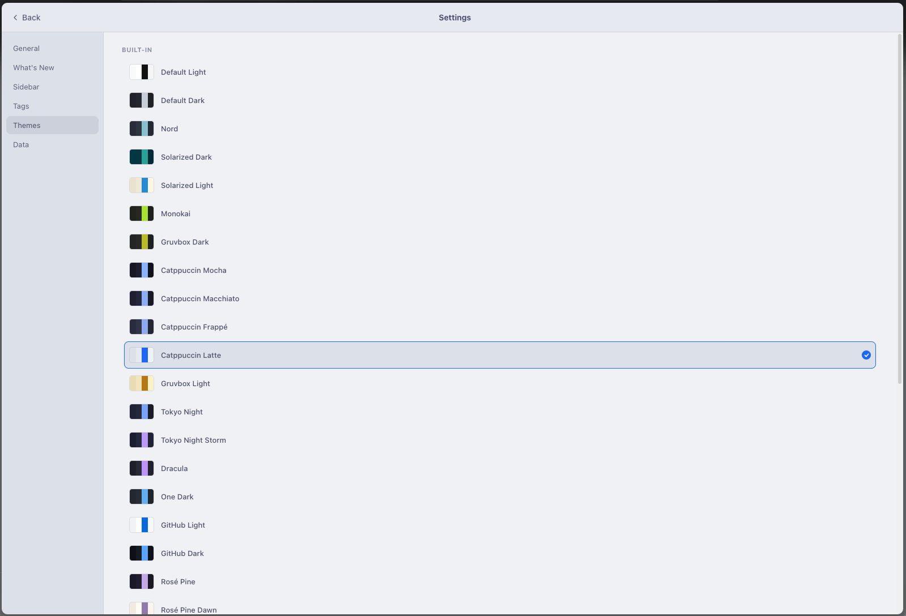

# Journery

A self-hosted private journaling app. Nestable folders, tagged notes, markdown-syntax editor, search. Runs on a NAS or any Docker host, accessed via browser on any device.





## What it does

- **Rich editor** — headings, bold/italic/underline/strike, pull quotes, inline & block code, links, checklists, and nested lists with depth-varying bullets
- Nested folders with rename, move, and drag-and-drop
- Tags with autocomplete, both in the sidebar and inline in the editor
- Full-text search across all notes
- Trash with 30-day retention + restore
- 20+ built-in themes, light and dark
- PWA — add to home screen on iOS/Android
- Auto-saves 2s after last keystroke
- Real-time sync polling across tabs/devices
- 3-pane layout on desktop; drill-down navigation on mobile

Formatting bar — headings, quotes, lists, checklists, code, links:



Make it yours with 20+ themes (Nord, Catppuccin, Gruvbox, Dracula, Solarized, and more):



## Try it first

Kick the tyres at **[demo-journery.setugk.com](https://demo-journery.setugk.com)** — a full demo where everything is saved only in your browser (nothing shared, nothing stored on a server). When you're ready, host your own below.

## Getting started

You own your data — it lives on hardware you control, and the Journery author never sees it or hosts it. Pick whichever path fits you.

### Easiest — host it on PikaPods (no server of your own)

No NAS, no spare machine, no command line? [**PikaPods**](https://www.pikapods.com) runs Journery for you for about **$1–2/month**. Your notes live on *your* pod — nobody else can see them, and no one hosts your data but you.

1. Create a [PikaPods](https://www.pikapods.com) account.
2. Add a pod running the image **`ghcr.io/setugk/journery`**.
3. Use these settings:
   - **Container port:** `5000`
   - **Volume:** mount storage at **`/data`** — every note lives here
   - *(optional)* set **`JOURNERY_USER`** + **`JOURNERY_PASS`** to require a login
4. Open the URL PikaPods gives you — that's your private Journery.

Export any time from **Settings → Data**. Want to move to your own hardware later? Same image, same data file — just follow the Docker steps below.

### Prefer to let an AI assistant set it up?

Not comfortable in a terminal? Paste this to an AI coding assistant (Claude, etc.) on the computer you want to host it on:

> Set up **Journery**, an open-source self-hosted journaling app, on this computer. My notes must stay on this machine — do not use any cloud service or send data anywhere.
> 1. Verify Docker is installed (`docker --version`); if not, install it (or give me steps for my OS).
> 2. Run: `docker run -d --name journery --restart unless-stopped -p 5050:5000 -v ~/journery-data:/data ghcr.io/setugk/journery:latest`
> 3. Verify it's running (`docker ps`) and that `http://localhost:5050` loads.
> 4. Tell me: the URL to open, that my notes live in `~/journery-data`, how to back them up (copy that folder), and how to enable a password (`JOURNERY_USER` / `JOURNERY_PASS`).

### Self-host with Docker

You'll need [Docker](https://docs.docker.com/get-docker/). Pin a release tag (e.g. `:v1.18.1`) for stability, or use `:latest` to track the newest build.

### Quickest — one command

```bash
docker run -d --name journery -p 5050:5000 -v ~/journery-data:/data ghcr.io/setugk/journery
```

Then open **http://localhost:5050**. No cloning, no build — your notes are stored in `~/journery-data`.

### Or with Docker Compose

```bash
curl -O https://raw.githubusercontent.com/setugk/journery/main/docker-compose.yml
docker compose up -d
```

Open **http://localhost:5050**. Data lives in `./data`.

### Where's my data?

Everything is a single SQLite file inside the volume you mounted (`~/journery-data` or `./data` above). **Point that at anywhere you like** — a folder on your NAS, an external drive, a named Docker volume:

```bash
-v /mnt/nas/journery:/data      # store it on your NAS
-v journery-data:/data          # a managed Docker volume
```

Back it up by copying that folder. Nothing ever leaves your machine.

### Keep a live Markdown copy (optional)

Don't want your notes trapped in a database at all? Point `MARKDOWN_MIRROR` at a mounted folder and Journery keeps a plain **`.md` file for every note** there — one file per note, in subfolders that match your folders — **updated on every change**, no export step:

```bash
docker run -d -p 5050:5000 \
  -v ~/journery-data:/data \
  -v ~/journery-vault:/mirror \
  -e MARKDOWN_MIRROR=/mirror \
  ghcr.io/setugk/journery
```

Now `~/journery-vault` always holds your notes as ordinary Markdown files — open them in Obsidian, point Syncthing or iCloud at the folder, grep them, whatever. Each file carries the title, dates, and tags as YAML front matter. If Journery ever disappears, your notes are already sitting there in the open.

It's **one-way** (Journery → files): a live, always-current copy, not a second place to edit — changes you make to the `.md` files won't sync back. Journery **owns** this folder (it removes files for notes you delete), so give it a dedicated one. When it's active, Settings → Data shows "Live Markdown mirror: On."

### Add a password (optional)

By default Journery runs with no login (handy on a private network). To require one, set two env vars:

```bash
docker run -d -p 5050:5000 -v ~/journery-data:/data \
  -e JOURNERY_USER=me -e JOURNERY_PASS=change-this \
  ghcr.io/setugk/journery
```

### Access it from anywhere

Put it behind a free [Cloudflare Tunnel](https://developers.cloudflare.com/cloudflare-one/connections/connect-networks/) (~10 min) for a public URL like `journery.yourdomain.com` that works from any device. Add a Cloudflare Access policy (email OTP) for auth — no app-level login needed.

## Stack

Flask + SQLite backend, vanilla JS SPA frontend — no build step, no bundler, no CDN dependencies.

## License

MIT
