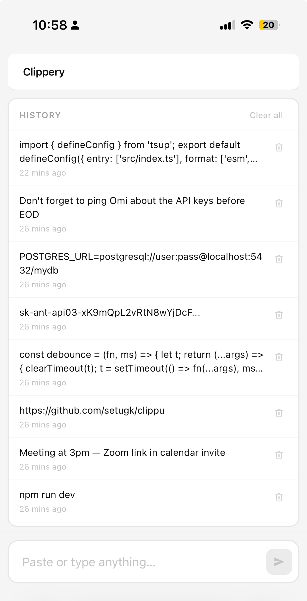

# Clippery

Remember Pushbullet? You'd copy something on your phone and it would just appear on your laptop. It was magical.

Then they killed the free tier. Then the app stopped getting updates. Then you moved on — back to emailing yourself links, texting yourself snippets, opening Notion just to paste a URL.

Clippery is the fix. Open it on any device, paste your text, and it's instantly there on every other device with it open. No account. No subscription. No "sign in with Apple." Just a tiny server you run yourself.




## What it does

- Paste text on one device, copy it on another
- History of the last 25 clips, always visible
- Click any item to preview the full text
- Auto-syncs across all open tabs every 2 seconds — no refresh needed
- Works on desktop and mobile

## Getting started

You'll need [Docker](https://docs.docker.com/get-docker/) installed. That's the only dependency.

**1. Clone the repo**
```bash
git clone https://github.com/setugk/clippery.git
cd clippery
```

**2. Set a username and password**

Open `docker-compose.yml` in any text editor and replace the placeholder values:
```yaml
environment:
  - CLIPPERY_USER=admin       # change this
  - CLIPPERY_PASS=changeme    # change this
```

**3. Start it**
```bash
docker compose up -d
```

**4. Open it**

Go to `http://localhost:5050` in your browser. You'll be prompted for the username and password you just set.

That's it. Open the same URL on any other device on your network and your clipboard is shared between them.

---

**Want to access it from anywhere — not just your home network?**

Put it behind a [Cloudflare Tunnel](https://developers.cloudflare.com/cloudflare-one/connections/connect-networks/). It's free, takes about 10 minutes to set up, and gives you a public URL like `clippery.yourdomain.com` that works from any device, anywhere.

## Stack

Single Python file. Flask backend, vanilla JS frontend — no build step, no bundler, no CDN dependencies. History stored as a JSON file on disk.

## License

MIT
