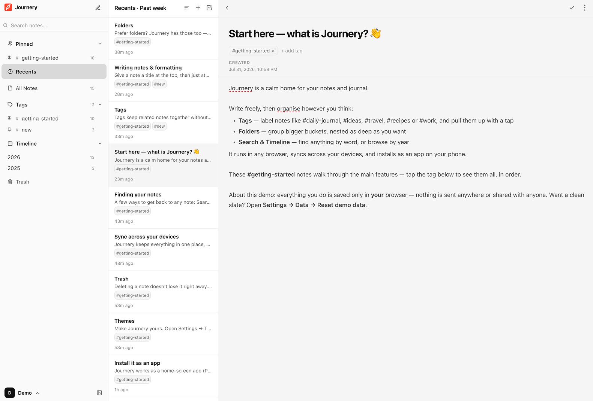
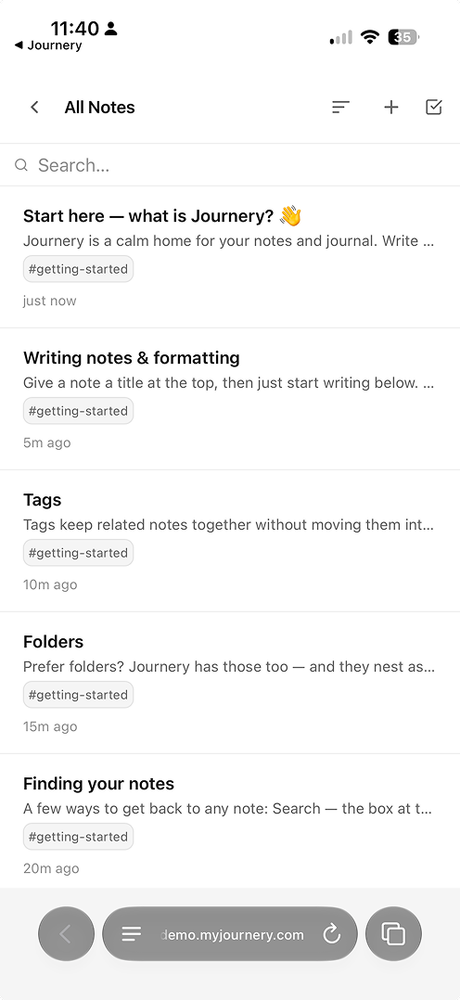
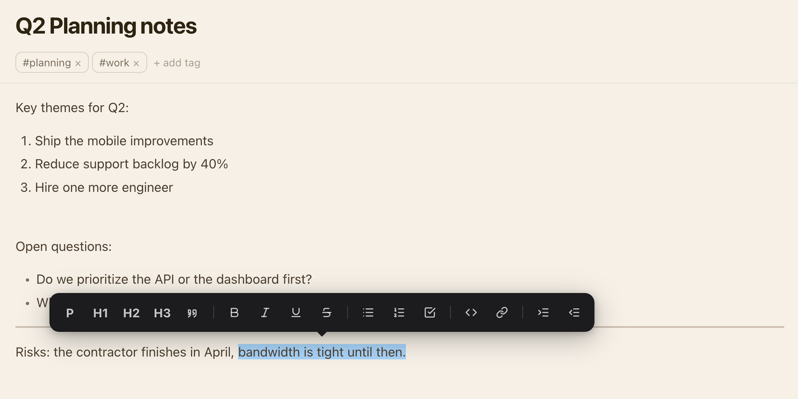
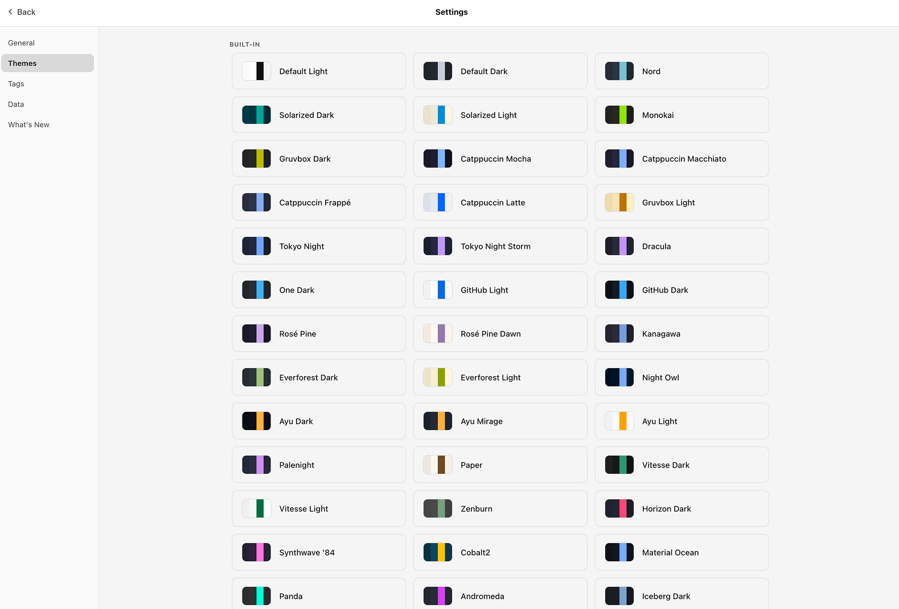
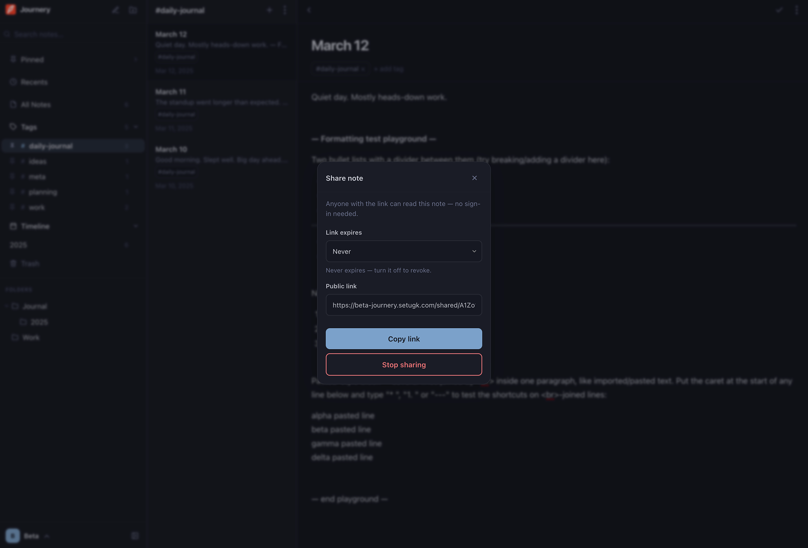

# Journery

A self-hosted private journaling app. Nestable folders, tagged notes, markdown-syntax editor, search. Runs on a NAS or any Docker host, accessed via browser on any device.





## What it does

- **Rich editor** — headings, bold/italic/underline/strike, pull quotes, inline & block code, links, checklists, and nested lists with depth-varying bullets; paste a URL and it auto-links, and Shift+Enter adds a soft line break
- **Word-level undo/redo** (Cmd/Ctrl+Z, Cmd/Ctrl+Shift+Z) — reliable even across list/format actions
- Nested folders and tags, with autocomplete — organise by either, or both
- **Drag and drop** (desktop) — a note into a folder or onto a tag, or a folder into another to nest it; drag to the Folders header to un-nest
- **Right-click** a note, folder, or tag for quick actions (rename, move, delete, pin, share)
- **Public share links** — turn any note, or a whole tag, into a read-only link anyone can open without signing in, with optional auto-expiry and one-tap revoke
- **Connect an AI assistant (MCP)** — opt-in, off by default: let Claude read, search, create, tag, and organise your notes through the Model Context Protocol, gated by a token you generate and can revoke any time
- Full-text search, plus a Timeline to browse by year
- Trash with 30-day retention + restore
- 48 built-in themes, light and dark — and your theme + display settings follow you across devices
- PWA — add to home screen on iOS/Android
- Auto-saves as you type; live sync across tabs and devices
- 3-pane layout on desktop; drill-down navigation on mobile

Rich text from a floating toolbar — headings, quotes, bold/italic/underline/strike, bullet & numbered lists, checklists, inline & block code, links, and indentation:



Make it yours with 48 built-in themes (Nord, Catppuccin, Gruvbox, Dracula, Solarized, Tokyo Night, Rosé Pine, and more), light and dark:



Share any note — or a whole tag — as a public, read-only link that anyone can open without signing in, with optional auto-expiry and one-tap revoke:



## Try it first

Kick the tyres at **[demo.myjournery.com](https://demo.myjournery.com)** — a full demo where everything is saved only in your browser (nothing shared, nothing stored on a server). When you're ready, host your own below.

*(That demo page uses cookie-less Cloudflare Web Analytics so I can see how many people try it — just page views, nothing else. Your own self-hosted instance has zero analytics of any kind, ever; see the privacy note below.)*

## Getting started

You own your data — it lives on hardware you control, and the Journery author never sees it or hosts it. Pick whichever path fits you.

### Easiest — host it on PikaPods (no server of your own)

No NAS, no spare machine, no command line? [**PikaPods**](https://www.pikapods.com) runs Journery for you for about **$1–2/month**. Your notes live on *your* pod — nobody else can see them, and no one hosts your data but you.

1. Create a [PikaPods](https://www.pikapods.com) account.
2. Add a pod running the image **`ghcr.io/setugk/journery`**.
3. Use these settings:
   - **Container port:** `5000`
   - **Volume:** mount storage at **`/data`** — every note lives here
   - *(optional)* set **`JOURNERY_USER`** + **`JOURNERY_PASS`** to require a login
4. Open the URL PikaPods gives you — that's your private Journery.

Export any time from **Settings → Data**. Want to move to your own hardware later? Same image, same data file — just follow the Docker steps below.

### Prefer to let an AI assistant set it up?

Not comfortable in a terminal? Paste this to an AI coding assistant (Claude, etc.) on the computer you want to host it on:

> Set up **Journery**, an open-source self-hosted journaling app, on this computer. My notes must stay on this machine — do not use any cloud service or send data anywhere.
> 1. Verify Docker is installed (`docker --version`); if not, install it (or give me steps for my OS).
> 2. Run: `docker run -d --name journery --restart unless-stopped -p 5050:5000 -v ~/journery-data:/data ghcr.io/setugk/journery:latest`
> 3. Verify it's running (`docker ps`) and that `http://localhost:5050` loads.
> 4. Tell me: the URL to open, that my notes live in `~/journery-data`, how to back them up (copy that folder), and how to enable a password (`JOURNERY_USER` / `JOURNERY_PASS`).

### Self-host with Docker

You'll need [Docker](https://docs.docker.com/get-docker/). Pin a release tag (e.g. `:v1.18.1`) for stability, or use `:latest` to track the newest build.

### Quickest — one command

```bash
docker run -d --name journery -p 5050:5000 -v ~/journery-data:/data ghcr.io/setugk/journery
```

Then open **http://localhost:5050**. No cloning, no build — your notes are stored in `~/journery-data`.

### Or with Docker Compose

```bash
curl -O https://raw.githubusercontent.com/setugk/journery/main/docker-compose.yml
docker compose up -d
```

Open **http://localhost:5050**. Data lives in `./data`.

### Where's my data?

Everything is a single SQLite file inside the volume you mounted (`~/journery-data` or `./data` above). **Point that at anywhere you like** — a folder on your NAS, an external drive, a named Docker volume:

```bash
-v /mnt/nas/journery:/data      # store it on your NAS
-v journery-data:/data          # a managed Docker volume
```

Back it up by copying that folder. Nothing ever leaves your machine. And any time you want your notes as portable files, **Settings → Data → Export as Markdown** gives you a `.zip` of `.md` files (one per note, folders preserved, with YAML front matter) — open them in Obsidian, Bear, or any editor.

### Add a password (optional)

By default Journery runs with no login (handy on a private network). To require one, set two env vars:

```bash
docker run -d -p 5050:5000 -v ~/journery-data:/data \
  -e JOURNERY_USER=me -e JOURNERY_PASS=change-this \
  ghcr.io/setugk/journery
```

### Access it from anywhere

Put it behind a free [Cloudflare Tunnel](https://developers.cloudflare.com/cloudflare-one/connections/connect-networks/) (~10 min) for a public URL like `journery.yourdomain.com` that works from any device. Add a Cloudflare Access policy (email OTP) for auth — no app-level login needed.

### Sharing notes publicly (one setup step if you use an auth gate)

Journery can turn any note — or a whole tag — into a **public link** anyone can read without signing in (a note's **⋯ → Share…**, or a tag view's **⋯ → Share tag**). Those links all live under the **`/shared/…`** path and render as self-contained pages; nothing else about your journal is exposed.

**The catch:** if you've put Journery behind an auth layer (Cloudflare Access, Authelia, Authentik, basic auth, a reverse-proxy login…), that same gate will block the people you share with — they'll hit *your* sign-in wall instead of the note. So you have to **exempt the `/shared/*` path** from your auth, and only that path.

**Cloudflare Access** (the most common setup): add a second Access application for **`yourdomain.com/shared/*`** with an **Action: Bypass** policy that includes **Everyone**, sitting alongside the main application that protects the rest of the site. That one rule is all it takes — leave it off and share links silently break; the app itself looks fine, so it's easy to miss.

> Quick test: open one of your own share links in a private/incognito window. If the note loads without asking you to log in, you're set. If it shows a sign-in screen, the bypass isn't in place yet.

Not using any auth gate (running open on a private network, or with just `JOURNERY_USER`/`JOURNERY_PASS`)? Nothing to do — share links work out of the box.

#### Setting it up with an AI assistant

Paste this to an AI coding/infra assistant that has access to your Cloudflare account or config:

> I self-host **Journery** at `journery.MYDOMAIN.com`, protected by **Cloudflare Access** (email OTP). Journery has a public-sharing feature: it serves shareable, sign-in-free pages under the path **`/shared/*`**, and those must stay reachable by anyone with the link. Right now my Access policy also gates `/shared/*`, so recipients hit my login wall.
> Please set up a **path-scoped bypass** so only `/shared/*` is public, while everything else stays protected:
> 1. In Cloudflare Zero Trust → Access → Applications, add a **new self-hosted application** for the hostname `journery.MYDOMAIN.com` with the path **`/shared`** (covering `/shared/*`).
> 2. Give it a single policy with **Action: Bypass** and Include: **Everyone**.
> 3. Make sure this application is **evaluated before** (listed above / more specific than) my existing application that protects `journery.MYDOMAIN.com`, so the bypass wins for `/shared/*` only.
> 4. Confirm the rest of the site still requires my email OTP, and tell me how to verify (e.g. open a `/shared/...` link in an incognito window — it should load with no login prompt).
> Do not expose any path other than `/shared/*`.

Using a different gate (Authelia, Authentik, NGINX/Traefik auth, etc.)? Same idea — allow `/shared/*` (and its sub-paths) through unauthenticated while keeping every other route protected.

### Connect an AI assistant (MCP)

Journery can expose a **[Model Context Protocol](https://modelcontextprotocol.io/) server** so an AI assistant — Claude Code today, and the Claude API's connector — can work with your notes for you (e.g. "add my Tokyo itinerary to my Japan trip note"). It's **opt-in and off by default**, and lives entirely inside the app you already run — no extra container or service.

Turn it on in **Settings → Connections**: flip **Claude access (MCP)** on, and Journery generates a **bearer token** (shown once — copy it). Your MCP URL is just your Journery address + **`/mcp`**. The Settings screen gives you the exact `claude mcp add …` command to paste into Claude Code.

**What the assistant can and can't do.** A deliberately safe subset: list, search, read, create, and append to notes; add tags; move notes between folders; create folders; and move a note to **Trash** (recoverable for 30 days). It **cannot** permanently delete a note or overwrite a note's existing content — so nothing it does is unrecoverable. Everything runs through the token; **revoke it any time** (Settings → Connections → Revoke) to cut off access instantly, and the endpoint stays dead whenever the toggle is off.

**Privacy.** This is the second thing in Journery that can talk to an outside program, and only when *you* turn it on and hand *your* AI client *your* token — Journery still never phones home on its own. The assistant you connect (e.g. Claude) will see the notes it reads; that's the point of connecting it. Off by default; nothing changes unless you enable it.

**One Cloudflare step if you use an auth gate.** Same catch as public sharing: an AI client can't complete an interactive Cloudflare Access / SSO login, so the `/mcp` path has to be **exempted** from your auth gate (the bearer token is its own gate). In **Cloudflare Access**, add a path-scoped **Bypass** policy for **`yourdomain.com/mcp`** (Include: Everyone) — exactly like the `/shared/*` bypass above, just a different path. Running open or with only `JOURNERY_USER`/`JOURNERY_PASS`? Nothing to do.

### Report a bug or send feedback

Your profile chip (bottom of the sidebar) has a **Report bug / Feedback** option. Whatever you type there — plus the app version and instance name, nothing else — is sent straight to the maintainer to help improve Journery. **Your notes are never included and never touched.** This is the one thing in Journery that talks to an external server by default (everything else is fully local); if you'd rather it didn't, just don't use that menu option — nothing else changes.

## Stack

Flask + SQLite backend, vanilla JS SPA frontend — no build step, no bundler, no CDN dependencies.

## License

MIT
